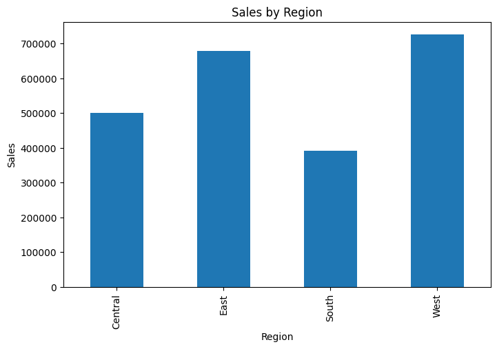
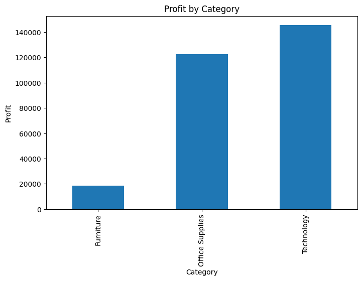
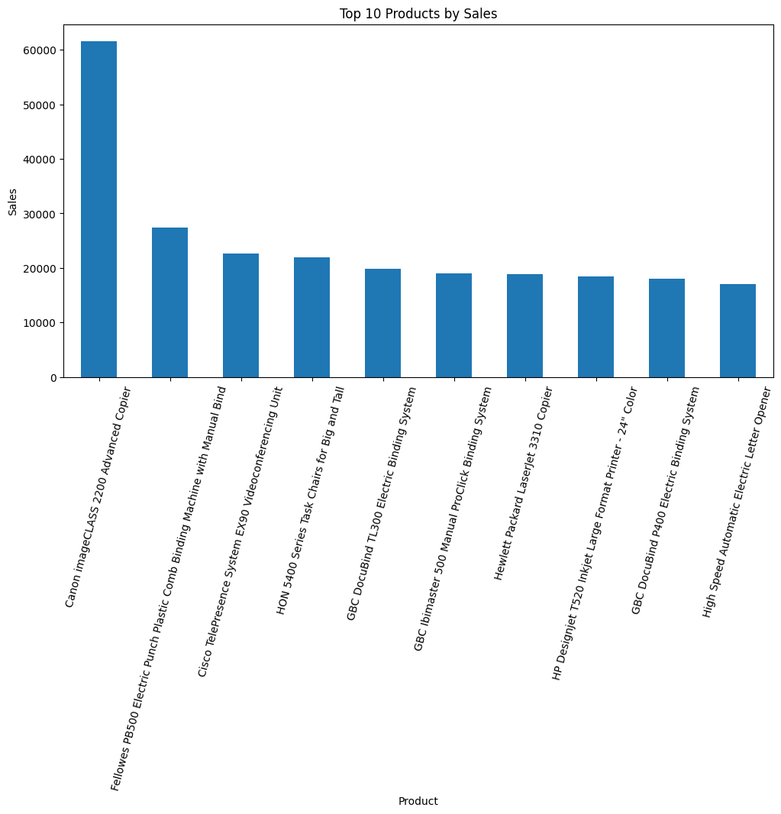

# Superstore Sales Analysis

## Project Overview

This project analyzes retail sales data from a Superstore dataset to uncover business insights related to revenue, profitability, product performance, and regional sales trends.

The objective was to transform raw sales data into actionable business recommendations using Python and data analytics techniques.

This project was completed as part of my Data Science Internship at Synent Technologies.

---

## Business Problem

Organizations generate large amounts of sales data, but decision-makers need meaningful insights to improve profitability and business performance.

This project aims to answer key business questions:

* Which regions generate the most revenue and profit?
* Which products perform best?
* Which product categories are most profitable?
* How do sales change over time?
* What business actions could improve performance?

---

## Dataset

Dataset: Sample Superstore Dataset

The dataset contains retail transaction records including:

* Order information
* Product details
* Customer information
* Sales
* Profit
* Quantity
* Discounts
* Regional data

Dataset Size:

* 9,994 records
* 21 columns

---

## Tools & Technologies

* Python
* Pandas
* NumPy
* Matplotlib
* Jupyter Notebook

---

## Project Workflow

### 1. Data Loading & Inspection

* Imported dataset
* Examined structure and data types
* Identified potential data quality issues

### 2. Data Cleaning

* Checked for missing values
* Checked for duplicate records
* Converted date columns for time-series analysis

### 3. Exploratory Data Analysis (EDA)

Performed analysis on:

* Monthly Revenue Trends
* Regional Sales Performance
* Product Performance
* Category Profitability
* Profit Analysis

### 4. Data Visualization

Created visualizations to identify:

* Sales patterns
* Top-performing products
* Regional performance
* Profitability trends

### 5. Business Recommendations

Generated actionable recommendations based on findings.

---

## Key Findings
## Key Results

- Total records analyzed: 9,994
- Highest performing region: West
- Most profitable category: Technology
- Best sales month: November 2017
- Lowest performing region: South

  ## Project Results

- Analyzed 9,994 retail sales transactions
- Identified the West region as the highest-performing region
- Found Technology to be the most profitable category
- Determined November 2017 as the strongest sales month
- Generated business recommendations to improve profitability
  
## Visualizations

### Monthly Revenue Trend

### Sales by Region

### Profit by Category

### Top 10 Products by Sales

### Revenue Trends

* Sales showed significant variation across months.
* November recorded the highest sales performance.

### Regional Analysis

* The West region generated the highest revenue and profit.
* The South region recorded the lowest sales performance.

### Category Analysis

* Technology was the most profitable category.
* Furniture generated strong sales but comparatively lower profit margins.

### Product Performance

* Several products contributed significantly to overall revenue.
* High-selling products were identified for potential business focus.

---

## Business Recommendations

1. Increase investment in Technology products due to strong profitability.

2. Review pricing and discount strategies for Furniture products to improve profit margins.

3. Implement targeted growth initiatives in lower-performing regions.

4. Plan marketing campaigns around peak-performing months to maximize revenue opportunities.

---

## Future Improvements

Future enhancements could include:

* Interactive Power BI Dashboard
* Customer Segmentation Analysis
* Sales Forecasting Models
* Profit Prediction using Machine Learning
* Real-time Business Intelligence Dashboard

---

## Author

Cwenga Ndzendze

Final-Year Computer Engineering Student

SQL Advanced Certified | Data Analytics | Cybersecurity | Python | Power BI

